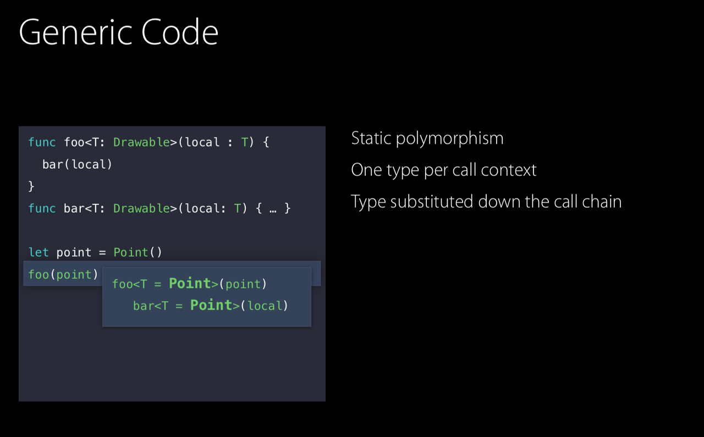

# Generic

- `foo` 함수가 실행되면 Generic 타입인 `T`를 `Point`에 바인딩 시킴
- 매개변수를 따라 호출 체인 아래로 대체되어 나감.(`bar` 함수의 매개변수는 `Point`로 대체됨)
- 이로써 더 정적인 형태의 다형성을 지원함

- 위 함수의 호출 컨텍스트에서 하나의 타입(Point)만 사용하므로 existential container는 사용하지 않는다.
- 대신 추가적인 Argument로 VWT, PWT를 전달한다.
    - 그럼 결국 existential container랑 똑같은거 아닌지?

- VWT를 통해서 필요한 모든 버퍼를 Heap공간에 할당하고 값을 복사한다.
- `draw()` 함수를 실행하면 PWT를 사용하여 실제 구현으로 jump한다.

- `local` 변수는 공간이 3개인 valueBuffer에 복사된다.
- `Point`의 경우 buffer크기보다 작으므로 inline에 저장된다.

- `Line`의 경우 buffer보다 커서 Heap에 저장되고 해당 메모리에 대한 포인터를 valueBuffer에 저장한다.

## Specialization of Generics

- 위 코드들은 컴파일 과정에서 최적화되어 프로토콜 파라미터 함수보다 성능이 좋아질 수 있다.

- `drawACopy` 함수의 호출 컨텍스트에서 `Point` 객체가 사용됨.

- Swift는 `Point` 타입으로 Generic 타입을 대체하고, 해당 타입 버전의 함수를 만든다.
- 최적화 과정에서 타입이 명시되므로 Dynamic dispatch 할 필요가 없어짐.

- 호출하는 타입별로 함수를 만든다.
→ 코드 사이즈 증가 이슈가 있다.
→ 코드 사이즈 증가 이슈는 aggressive compiler optimization으로 코드사이즈를 줄일수 있다.

### aggressive compiler optimization

## Whole Module Optimization

- main.swift 파일 내에서 Point를 선언하고, 인스턴스를 생성하여 Generic 함수에 사용하면 최적화가 가능하다.
- 한 파일내에 있을때 타입 추론이 가능하므로 specialization 가능함

### 선언부와 사용한 내용이 한 파일 내에 없으면?

- Whole Module Optimization 을 통해서 두 파일을 하나의 단위로 컴파일하므로 Point.swift 파일에 대한 insight를 가지며 최적화가 수행될 수 있다.
    - Whole Module Optimization은 Xcode8 이후로 기본값으로 적용되어 있다.

## Protocol Type과의 비교

- 위 경우 Line이 existential container의 valueBuffer에 fit하지 않으므로 Heap 할당이 두 번 일어난다.

- Generic의 경우 T가 하나의 타입으로 고정된다.
- specialization을 통해서 T를 Line으로 대체하기 때문에 existential container가 필요하지 않고, Heap 할당이 필요 없어진다.
또한, 타입이 확정되므로 static dispatch를 할 수 있다.
→ PWT가 필요없으므로 Heap 할당이 한 번 더 줄어든다.

## 결론

- 구조체를 Specialized Generic으로 사용하면 파라미터로 값을 복사할 때 Heap 할당이 필요하지 않고, 레퍼런스 타입을 가지고 있지 않다면 레퍼런스 카운팅도 필요없고, Static Dispatch 사용한다.
- 그래서 굉장히 빠르다.

- 반면, 클래스는 Specialized Generic으로 사용해도 Heap 할당이 일어나고, 레퍼런스 카운팅도 하고, vtable을 사용한 Dynamic dispatch를 사용한다.

- Generic을 사용하지 않은 작은 값은 existential container를 사용하므로 Heap 할당은 없고, 레퍼런스 카운팅도 없다.
- 대신, PWT로 Dynamic dispatch한다.

- Generic을 사용하지 않은 큰 값은 existential container의 valueBuffer에 fit하지 않으므로, Heap 할당이 이루어지고, 레퍼런스 카운팅도 있다. 또한, PWT로 Dynamic dispatch한다.

- 동적 런타임 타입 요구 사항이 가장 적은 방향으로 추상화를 하자
    - Generic을 통한 최적화
    - vtable을 사용하는 클래스 대신 구조체나 enum등 값 타입 사용
- 값 타입을 사용하여 value sementic 체계를 얻을 수 있다.
- Generic을 통한 정적인 형태의 다형성을 구성하면 좋다.
- 큰 값을 사용하는 경우 CoW를 사용해서 복사의 비용을 줄일 수 있다.
