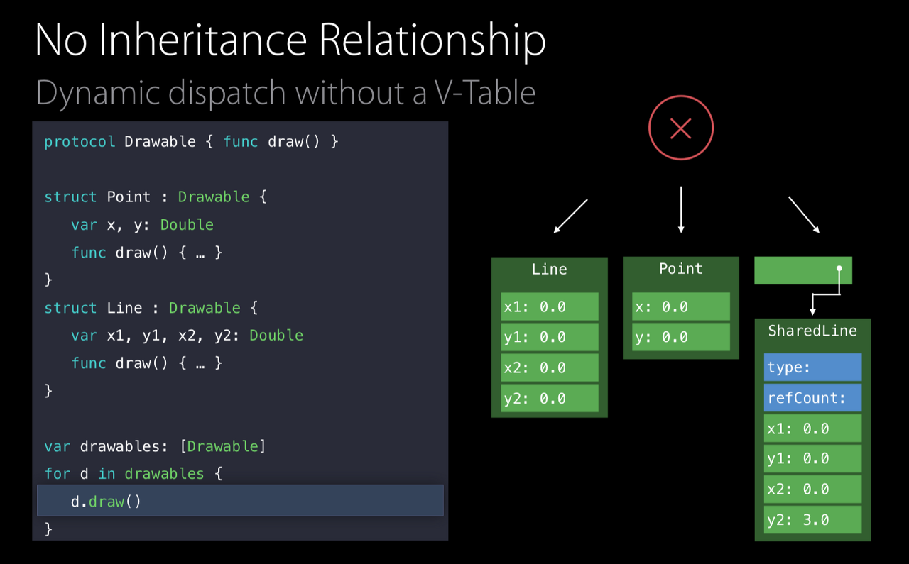

# Protocol Types

- Point, Line이 class 가 아닌 struct로 작성된 경우, 클래스처럼 상속 기반 다형성이 아니므로 vtable이 필요 없다.

그래서 Protocol Witness Table(PWT)을 사용함.

- drawables의 element에 접근하여 draw()를 호출하면 해당 프로토콜의 PWT를 타고 실제 구현된 내용까지 도달한다.

### 값 타입 배열

struct는 값 타입이기 때문에 배열에 레퍼런스가 아닌 실제 값이 들어가야 한다. 하지만 특정 프로토콜에 대한 배열은 각 element 별로 크기가 다를 수 있다.
ex) `var drawables: [Drawable]`
배열은 element들을 고정된 크기 안에 저장하기 때문에 문제가 생기는데 이런 경우를 위해서 Extential Container라는 특수한 storage layout을 사용한다.

- 컨테이너의 처음엔 valueBuffer 3개가 할당된다.

- `Point`의 경우 buffer를 2만큼만 사용하므로 컨테이너 내부에 값이 저장될 수 있다.

- `Line`은 buffer를 4개 필요로 하기 때문에 컨테이너 내에 저장되지 못하고 Heap 메모리에 저장된다.
- 해당 Heap 메모리에 대한 포인터를 valueBuffer에 저장한다.

## Value Witness Table(VWT)

### allocate

- 타입마다 Existential Container를 관리하는 Value Witness Table을 가진다.

- VWT에는 allocate함수가 있으며, Line의 경우에는 Heap 메모리를 할당하고 valueBuffer에 해당 Heap 메모리의 포인터를 저장하는 동작을 한다.
- Point의 경우 위 작업이 필요하지 않다.(valueBuffer에 들어가므로..)

### copy

- copy 함수는 실제로 값을 메모리에 저장시킨다.
- Line의 경우 valueBuffer에 저장된 포인터를 따라 이미 할당된 Heap 메모리에 접근하고, 값을 복사한다.
- Point의 경우 valueBuffer에 직접 값을 복사한다.

### destruct

- 변수의 lifetime이 끝나면 Swift는 VWT의 destruct 함수를 실행시킨다.
- Line의 경우 해당 함수가 호출되면 할당된 Heap 메모리에 대한 레퍼런스 카운트를 감소시킨다.

### deallocate

- destruct이후 deallocate를 호출하며 Heap메모리 할당을 해제한다.
- Point의 경우 할당된 Heap메모리가 없으므로 값을 지운다.

## Existential Container

- Existential Container마다 vwt, pwt를 가지고 있다.
- vwt에서 저장프로퍼티들을 관리하고, pwt에서 프로토콜 메소드를 관리한다.

### 예제

- 위 코드를 실행하면 Swift는 Existential Container를 생성한다.

- drawACopy함수를 호출하면 Existential Container를 Argument로 전달한다.
- 매개변수에 대한 로컬 변수(local)가 만들어지고 argument가 할당된다.

- local의 필드들을 val로 전달된 값으로 초기화 한다.
- vwt와 pwt모두 Heap 메모리에 할당된다.

- Point의 경우 buffer크기 미만이라 Heap 할당이 필요하지 않으므로, 바로 값이 복사된다.

- Line의 경우 buffer크기보다 커서 Heap 메모리를 할당하고, 값을 복사한다.

- draw()를 호출하는 내용은 Swift에서 pwt의 draw를 호출한다.
- projectBuffer는 draw 동작에 사용할 값들의 주소값이다.
    - Point의 경우 container 시작 주소
    - Line의 경우 Heap 메모리에 value가 할당된 주소

- draw() 함수의 수행이 완료되고 나면 local이라는 변수는 scope를 벗어나게 되므로 vwt의 destruct를 수행한다.

- 레퍼런스 카운트를 감소시키고

- buffer에 할당된 값을 deallocate한다.

위와 같은 방식으로 struct가 다형성을 지원할 수 있게된다.
