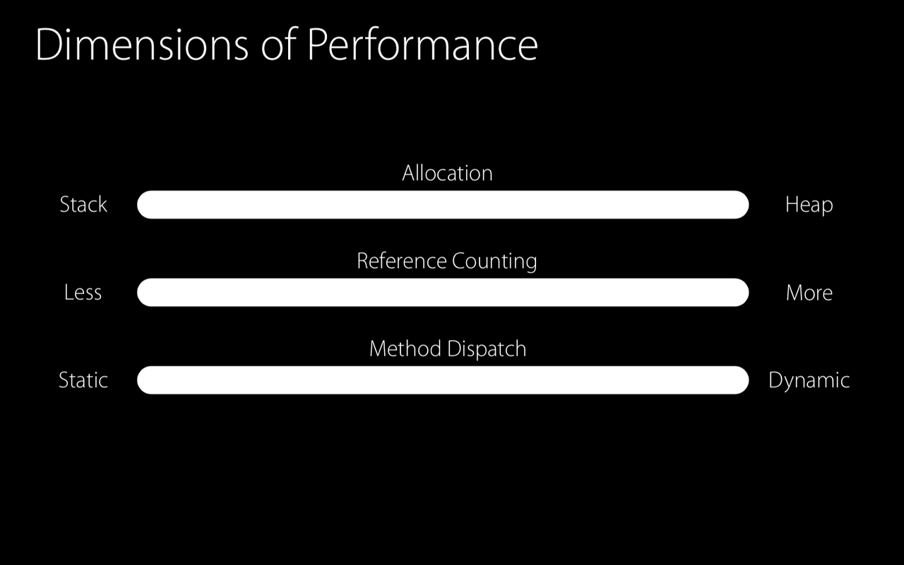

# Understanding Swift Performance

## Swift의 성능

1. 인스턴스가 생성된 장소 → Stack vs Heap
2. 인스턴스를 전달할 때 Reference Counting 오버헤드가 일어나는지?
3. 메소드를 호출할 때 → Static dispatch vs Dynamic dispatch

오른쪽으로 갈수록 성능이 나빠지고, 왼쪽으로 갈수록 좋아진다.

## Allocation

Swift는 자동으로 메모리 할당 및 해제를 한다. Stack, Heap 두가지 메모리 구조에 나눠서 할당된다.

### Stack

- Top으로만 push 및 pop이 가능하다.
    - Top을 가리키는 포인터를 Stack pointer라고 명칭함.
- Stack pointer를 줄여서 메모리 공간을 할당함.
- Stack pointer를 늘려서 메모리 공간을 해제함.

### Heap

- Dynamic lifetime을 가진 메모리를 할당 할 수 있다.
- 미 사용 블록을 탐색해서 할당하고, 메모리 블록을 적절한 위치로 재삽입해서 해제한다.
- Heap 메모리의 경우 여러 스레드에서 접근하고 할당 및 해제가 가능하므로 locking등의 동기화 매커니즘을 이용해서 무결성을 보호해야 한다.
- 여러모로 Stack에 비해서 비용이 크다.

## Stack 메모리 할당

- `Point`는 구조체이기 때문에 Stack에 메모리가 할당되며 해당 메모리에 값이 저장됨

- `point1`, `point2` 를 사용하고 나면 Stack 포인터를 증가시켜서 메모리 해제를 시킨다.

## Heap 메모리 할당

- Point는 Class로 선언되어 Stack에는 레퍼런스를 위한 메모리를 할당함.
- Point 인스턴스를 생성할 때 Swift는 Heap을 lock하고(무결성 보장), 해당 크기의 메모리 블록을 검색한다.

- point2에 point1의 값을 대입했음에도 값을 복사하지 않고, 레퍼런스를 복사함.
→ 동일한 인스턴스를 바라보는 두개의 point 변수가 생성됨.

- point 변수들을 다 사용하고 나면 다시 Heap을 lock하고 해당 블록들을 적절한 위치로 재삽입하여 할당을 해제한다.

- 그러고 나서야 Stack 메모리를 해제할 수 있다.

Class가 Struct보다 생성에 드는 비용이 크다.

### Example

- enum case들을 통해서 말풍선 이미지를 반환하는 함수 `makeBallon`이다.
- 성능을 위해서 `cache`를 생성한다.

다만, `cache`의 key 값은 String인데 String은 가변 크기의 자료형으로서 Heap 메모리에 할당된다.
결과적으로, `cache`에서 Heap 메모리 할당이 발생한다.

- Attributes라는 구조체를 만들고, dictionary의 key값으로 사용이 가능하도록 Hashable을 준수하도록 한다.
- Attributes는 구조체이기 때문에 Stack에 메모리 할당을 하게되어, Heap 할당에서 오는 오버헤드를 줄일 수 있다.
- 또한, String이 key인 경우보다 의도하지 않은 데이터가 삽입될 위험성도 줄어든다.(수동으로 키를 만들어서 넣는것이 아니라 Attributes 자체를 key로 사용하므로..)

## Reference Counting

Swift는 Heap에 있는 인스턴스에 대한 총 레퍼런스 카운트를 유지한다. 어떤 인스턴스의 레퍼런스 카운트는 해당 인스턴스 안에 존재한다.

- `Point`를 Class 인스턴스를 생성했으므로 Heap 메모리에 할당되며, 레퍼런스 카운트를 한다.
- Swift 컴파일러가 해당 클래스 내부에 `refCount`라는 프로퍼티를 삽입하고, 적절한 위치에 `retain`, `release`를 삽입한다.

- `point1`이 할당될 때 기본적으로 `refCount`가 1이 된다.

- 이후에 `point2`에 `point1`의 값을 대입하게 되어 point2의 Stack메모리에 point1과 동일한 인스턴스의 주소값이 대입된다.
- 단, 아직 `retain`을 하기 전이기 때문에 `refCount`는 1을 유지함.

- `retain`이 호출되고 `refCount` 증가

- 인스턴스를 다 사용하고 나면 `release`호출로 `refCount` 감소
- `refCount`가 0이 되면 Swift는 Heap을 lock하고 해당 메모리 블록을 반환한다.

## 복잡한 형태의 Struct

- Label이라는 Struct
    - String, UIFont 타입의 프로퍼티를 가지고 있음.
    - String, UIFont는 Heap 메모리에 할당.
- Struct여도 프로퍼티들이 Heap 메모리에 할당되므로 레퍼런스 카운팅 오버헤드가 존재한다!
- 둘 이상의 레퍼런스가 있는 경우에는 Class 보다 레퍼런스 카운팅 오버헤드가 더 커짐. 따로따로 카운팅 하므로..

### 최적화 팁

- Attachment 구조체내에 URL, String 프로퍼티가 존재하며 해당 타입은 모두 Heap 메모리에 할당된다.

- uuid는 UUID로, mimeType은 enum으로 선언하여 Stack 메모리에 할당되도록 하여 개선한다.

- 결과적으로 fileURL만 Heap 메모리에 할당하도록 하여 레퍼런스 카운팅 오버헤드를 줄인다.
- 이제서야 Attachment가 Struct로서의 장점을 유지할 수 있다.

## Method Dispatch

구현된 메소드를 사용할 때 어떤 메소드를 사용할 것인지를 결정하는 과정이다.

### Static Dispatch

- 컴파일 타임에 어떤 구현을 실행할지 결정함.

### Dynamic Dispatch

- 컴파일 타임에 어떤 구현을 실행할지 결정하지 못할때, 런타임에 실제로 실행할 구현으로 jump하는 방식이다.

스레드 동기화, 레퍼런스 카운팅, Heap 할당에 대한 오버헤드는 없다고 하더라도 Dynamic Dispatch는 컴파일러의 가시성(visibility)을 차단하므로 최적화를 막는다.

### Static Dispatch Example

- `drawAPoint` 함수는 단순히 파라미터로 `Point` 인스턴스를 받고 해당 인스턴스의 `draw`함수를 호출한다.

- 무슨 함수를 호출해야 할 지 명확하기 때문에 위와 같이 `point`의 `draw`함수를 직접 호출하도록 최적화가 가능하다.

- 혹은 `draw`함수의 구현을 그대로 갖다 붙일수도 있다.

### Dynamic Dispatch Example

Dynamic Dispatch를 사용하는 이유는 다형성(polymorphism)이라는 강력한 것들이 가능하기 때문이다.

- Drawable이라는 super class가 존재하고, 해당 클래스를 서브클래싱하는 Point, Line 클래스가 있다.
- drawables라는 변수는 각 객체의 레퍼런스가 저장된 배열을 Heap 변수에 가지고 있고, 각각의 element들은 다시 각 인스턴스의 Heap메모리 레퍼런스를 가지고 있다.

- for 문을 돌면서 각 Drawable 인스턴스들에 접근해서 draw()를 호출한다.
    - 다만, 해당 호출이 Point의 draw()인지, Line의 draw()인지 알 수 없다..
    - 그렇기 때문에 컴파일러는 class타입 정보에 대한것을 정적 메모리에 미리 저장한다.
    → Virtual method table(vtable)
- 실제로 draw()함수를 호출할 때 vtable을 조회해서 적합한 draw 함수를 찾고 파라미터로 인스턴스를 전달한다.

class는 기본적으로 Dynamic Dispatch를 하므로, 메소드 체인, 인라인과 같은 최적화를 막을 수 있다.

### 해결책

final이나 private으로 선언하게 되면 컴파일 타임에 어떤 함수를 실행할지 명확히 할 수 있기 때문에, Static Dispatch를 하게된다. 해당 키워드를 적절히 활용하자.

## 결론

## Protocol Types
[ProtocolTypes](ProtocolTypes/ProtocolTypes.md)

## Generic
[Generic](Generic/Generic.md)
